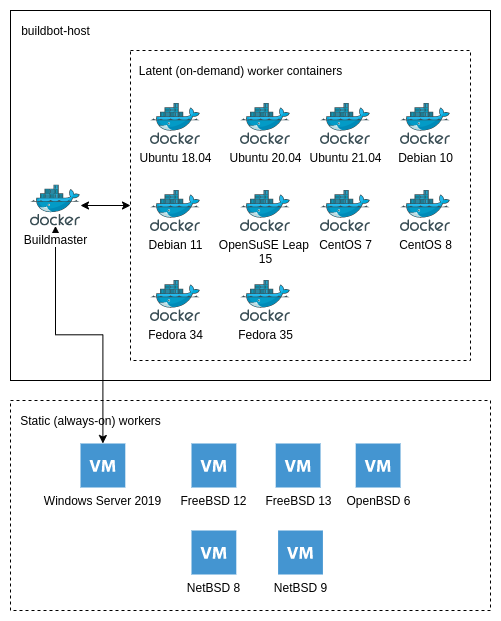

# Introduction

This is CI/CD system built on top of Buildbot using Vagrant, a virtualization
layer (Virtualbox/Hyper-V) and Docker. Here's an overview of the design
(details vary depending on the deployment):

The system does not require Vagrant, Virtualbox or Hyper-V  - those are only a
convenience to allow setting up an isolated environment easily on any computer
(Linux, Windows, MacOS).

This system has been tested on:

* Vagrant + Virtualbox on Fedora Linux 34
* Vagrant + Virtualbox Windows 10
* Vagrant + Hyper-V on Windows 10
* Amazon EC2 Ubuntu 20.04 server instance (t3a.large)

The whole system is configured to use 8GB of memory. However, it could potentially run in less, because
all the buildbot workers that do the heavy lifting are either: 

# Supported build types for OpenVPN 2.x

* Basic Unix compile tests using arbitrary, configurable configure options
* Unix connectivity tests using t_client.sh (see OpenVPN Git repository)
* Native Windows builds using MSVC to (cross-)compile for x86, x64 and arm64 plus MSI packaging and signing
* Debian/Ubuntu packaging (partially implemented)

# Supported build types for OpenVPN 3.x

* Compile tests against OpenSSL and stable release of ASIO

# Setup

If you use Vagrant with Virtualbox you need to install Virtualbox Guest
Additions to the VMs. The easiest way to do that is with
[vagrant-vbguest](https://github.com/dotless-de/vagrant-vbguest):

    $ vagrant plugin install vagrant-vbguest

Without this plugin Virtualbox shared folders will not work and you will get
errors when you create the VMs.

After that you should be able to just do

    $ vagrant up buildbot-host

and once that has finished you can adapt buildbot configuration to your needs,
rebuild the buildmaster container and start using the system.

Note that provisioning is only tested on Ubuntu 20.04 server and is unlikely to
work on any other Ubuntu or Debian version without modifications. When setting
this environment up outside of Vagrant you should do

    $ cp provision-default.env provision.env

then modify *provision.env* to look reasonable. For example in AWS EC2 you'd
use something like this:

    VOLUME_DIR=/var/lib/docker/volumes/buildmaster/_data/
    WORKER_PASSWORD=mysecretpassword
    DEFAULT_USER=ubuntu

The values get passed to *provision.sh*, which configures things accordingly.

## Relevant files and directories:

This environment utilizes a number of scripts for settings things up. The
following script are used internally and typically you would not touch them:

* *provision.sh*: used to set up the Docker host
* *create-volumes.sh*: create or recreate Docker volumes for the buildmaster and workers

Most of the time you'd be using these scripts:

* *rebuild.sh*: rebuild a single Docker image
* *rebuild-all.sh*: rebuild all Docker images
* *buildmaster/launch.sh*: launch the buildmaster

If you want to experiment with static (non-latent) Docker buildbot workers you
may also use:

* *launch.sh*: launch a buildbot worker

Here's a list of relevant directories:

* *buildmaster*: files, directories and configuration related to the buildmaster
    * *master-default.ini*: global/buildmaster settings (Git repo URLs etc). Does not get loaded if *master.ini* (below) is present.
    * *master.ini*: local, unversioned config file with which you can override *master-default.ini*.
    * *worker-default.ini*: buildbot worker settings. The \[DEFAULT\] section sets the defaults, which can be overridden on a per-worker basis. Does not get loaded if *worker.ini* (below) is present.
    * *worker.ini*: local, unversioned config file with which you can override *worker-default.ini*.
    * *master.cfg*: buildmaster's "configuration file" that is really just Python code. It is solely responsible for defining what Buildbot and its workers should do.
    * *debian*: this directory contains all the Debian and Ubuntu packaging files arranged by worker name. During Debian packaging builds the relevant files get copied to the Debian/Ubuntu worker.
* *buildbot-worker-\<something\>*: files and configuration related to a worker
    * *Dockerfile.base*: a "configuration file" that contains ARG entries that will drive the logic in the main Dockerfile, *snippets/Dockerfile.common*. Used when provisioning the container.
    * *env*: sets environment variables that are required by the worker container (buildmaster, worker name, worker pass). Used when launching *static* containers. Not needed for *latent* workers. In other words, in most cases you can ignore the *env* file.
* *scripts*: reusable worker initialization/provisioning scripts
* *snippets*: configuration fragments; current only the reusable part of the Dockerfile
* *openvpn*:
    * files containing the build steps for OpenVPN 2.x (included by master.cfg)
* *openvpn3*:
    * files containing the build steps for OpenVPN 3.x (included by master.cfg)

# The Docker setup

This Docker-based environment attempts to be stateless and self-contained.
While all the containers have persistent volumes mounted on the host, only
buildmaster actually utilizes the volume for anything (storing the worker
password and the sqlite database). The worker containers are launched on-demand
and get nuked afterwards. On next build everything starts from scratch.

Build artefacts can be copied from the workers to the buildmaster before the
worker exits, or copied elsewhere during build.

The containers (master and workers) do not require any data to be present on
the persistent volumes to work. The only exception is the worker password that
needs to be in a file on buildmaster's persistent volume.

# Development

## Defining image version and name

The Dockerfile or Dockerfile.base used to build the images contains some
metadata based on (mis)use of Docker's ARG parameter. This allows parameterless
image rebuild and container launch scripts. You should not change the image
metadata unless you have a specific reason for it: reusing the same tag will
simplify things especially in Vagrant.

## Building the docker images

Buildbot depends on pre-built images. To (re)build a worker:

    cd buildbot-host
    ./rebuild.sh <worker-dir>

For example

    ./rebuild.sh buildbot-worker-ubuntu-2004

To build the master:

    ./rebuild.sh buildmaster

To rebuild all containers (master and workers):

    ./rebuild-all.sh

Due to docker caching you can typically rebuild everything in a few seconds if
you're just changing config files.

## Changing buildmaster configuration

Buildmaster has several configuration files:

* *master.cfg*: this is the Python code that drives logic in Buildbot; it should have as little configuration it is as possible
* *master-default.ini*: the default master configuration, contains Docker and Git settings
* *master.ini*: overrides settings in master-default.ini completely, if present
* *worker-default.ini*: the default worker configuration, contains a list of workers and their settings
* *worker.ini*: overrides settings in worker-default.ini completely, if present

While you can launch a buildmaster with default settings just fine, you
probably want to copy *master-default.ini* and *worker-default.ini* as *master.ini*
and *worker.ini*, respectively, and adapt them to your needs.

It is possible to do rapid iteration of buildmaster configuration. For example:

    vi buildmaster/master.cfg
    docker container stop buildmaster
    ./rebuild.sh buildmaster

Then from the "buildmaster" subdirectory:

    ./launch.sh v2.0.0

# Debugging

## Worker stalling in "Preparing worker" stage

If your workers hang indefinitely at "Preparing worker" stage then the problem
is almost certainly a broken container image. Usually building the Docker image
failed in a way that buildbot did not install properly, which caused the "CMD"
at the end of the Dockerfile to fail. The fix is to nuke the image, fix the problem and
rebuild the image. Get the ID of the image that does not work:

    docker container ls

Remove it:

    docker container rm -f <id>

(Attempt to) Fix the problem. Then rebuild the image and ensure that the process works:

    cd buildbot-host
    ./rebuild.sh buildbot-worker-<something>

The rebuild.sh expect a worker directory as its one and only parameter.

## Debugging build or connectivity test issues

Probably the easiest way debug issues on workers (e.g. missing build
dependencies, failing t_client tests) is to just add a "sleep" build step to
master.cfg right after the failing step. For example:

    factory.addStep(steps.ShellCommand(command=["sleep", "36000"]))

This prevents buildmaster from destroying the latent docker buildslave before
you have had time to investigate. To log in to the container use a command like
this:

    docker container exec -it buildbot-ubuntu-1804-e8a345 /bin/sh

Check "docker container ls" to get the name of the container.

## Simulating always-on buildbot workers

Buildbot launches the docker workers on-demand, so there are only two use-cases for non-latent always-on docker workers:

* Initial image setup: figuring out what needs to be installed etc.
* Simulating always-on workers: this can be useful when developing master.cfg

The always-on dockerized workers get their buildbot settings from \<worker-dir\>/env that
you should modify to look something like this:

    BUILDMASTER=buildmaster
    WORKERNAME=ubuntu-2004-alwayson
    WORKERPASS=vagrant

You also need to modify buildmaster/worker.ini to include a section for your
new always-on worker:

    [ubuntu-2004-static]
    type=normal

Then rebuild and relaunch buildmaster as shown above. Now you're ready to launch your new worker manually:

    cd buildbot-host
    ./launch.sh <worker-dir>

For example:

    ./launch.sh buildbot-worker-ubuntu-2004

## Wiping buildmaster's database

In Vagrant it can be useful to occasionally destroy the buildmaster's database
to clean up the webui:

    sudo rm /var/lib/docker/volumes/buildmaster/_data/libstate.sqlite

You generally don't want to do this in production if you're interested in
retaining the data about old builds.

# Usage

## Launching the buildmaster

Buildmaster uses a separate launch script:

    cd buildbot-host/buildmaster
    ./launch.sh v2.0.0

Note that you need to rebuild the buildmaster image on every configuration
change, but the process is really fast.

## Launching non-latent workers

Right now there is only one and you can launch with Vagrant:

    vagrant up buildbot-worker-windows-server-2019

The worker will automatically connect to the buildmaster if provisioning went
well.  That said, provisioning Windows tends to be way more unreliable than
provisioning Linux, so you may have to destroy and rebuild it a few times. The
main reason for provisioning failures are the reboots that are required:
Vagrant is sometimes unable to re-establish WinRM connectivity when the VM
comes back up.

# Appendix 1: differences between build configurations

These are some of the current and past differences between the buildbot
workers, builders and projects being built.

## Worker / operating system level

* openbsd-49-i386: needs --disable-plugin-auth-pam
* macosx-amd64: different home directory: /Users/buildbot
* t_client tests that are enabled vary between workers

## Builder level

* OpenSSL and mbedTLS builders without any other configure flags must run unit tests
* Some builders (e.g. openvpn-build, MSVC Windows builds) are very special

## Project level

* OpenVPN 2.x
* OpenVPN 3.x
